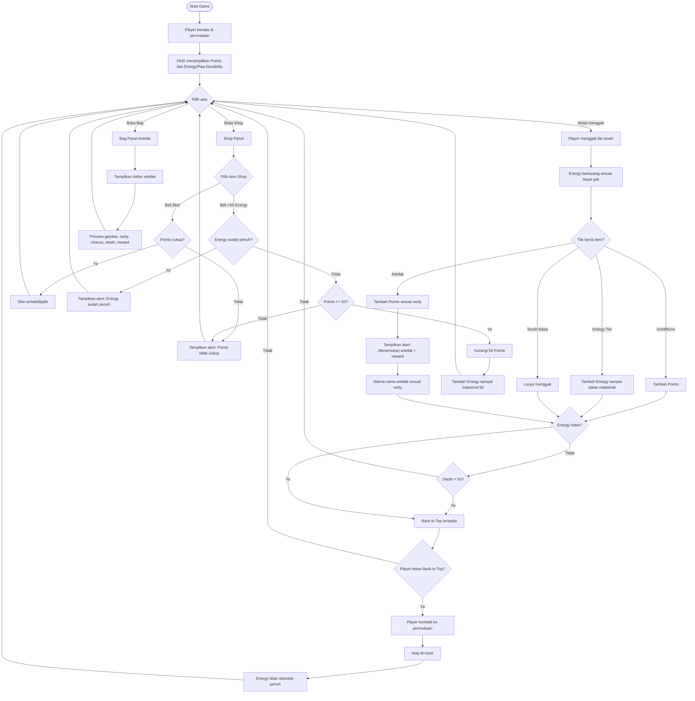
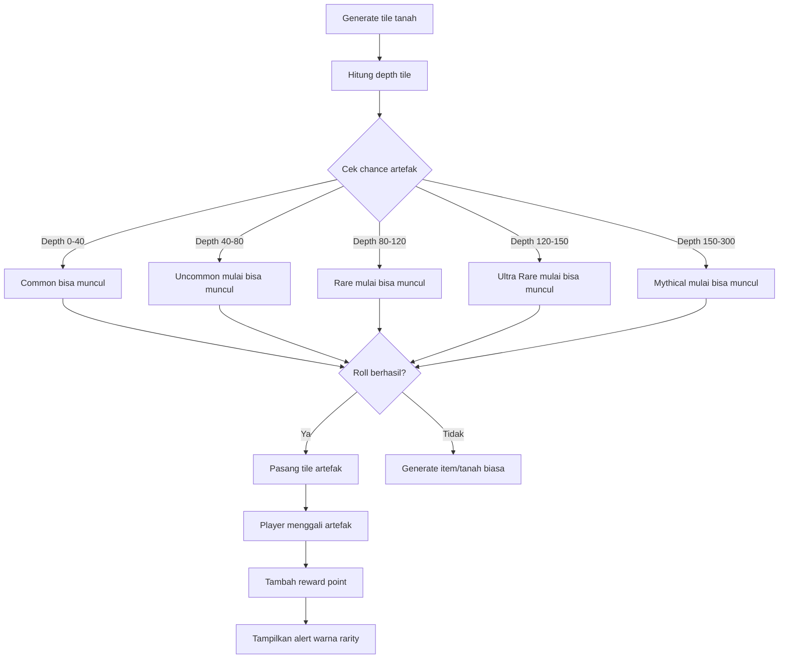
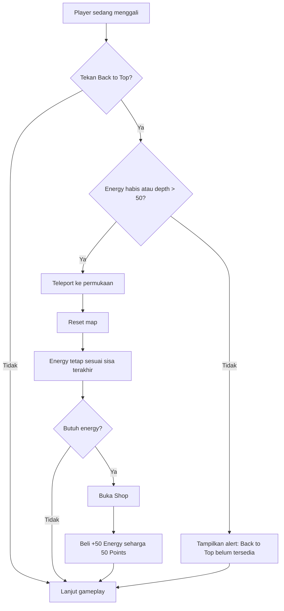

# Flowchart Gameplay Sworn Treasure

```mermaid
flowchart TD
    A([Start Game]) --> B[Player berada di permukaan]
    B --> C[HUD menampilkan Points dan Energy/Paw Durability]
    C --> D{Pilih aksi}

    D -->|Mulai menggali| E[Player menggali tile tanah]
    D -->|Buka Shop| S[Shop Panel]
    D -->|Buka Bag| G[Bag Panel Artefak]

    E --> F[Energy berkurang sesuai biaya gali]
    F --> H{Tile berisi item?}

    H -->|Gold/Bone| I[Tambah Points]
    H -->|Energy Tile| J[Tambah Energy sampai batas maksimal]
    H -->|Artefak| K[Tambah Points sesuai rarity]
    H -->|Tanah biasa| L[Lanjut menggali]

    K --> K1[Tampilkan alert: Menemukan artefak + reward]
    K1 --> K2[Warna nama artefak sesuai rarity]
    I --> M{Energy habis?}
    J --> M
    L --> M
    K2 --> M

    M -->|Tidak| N{Depth > 50?}
    N -->|Tidak| D
    N -->|Ya| O[Back to Top tersedia]
    M -->|Ya| O

    O --> P{Player tekan Back to Top?}
    P -->|Tidak| D
    P -->|Ya| Q[Player kembali ke permukaan]
    Q --> R[Map di-reset]
    R --> R1[Energy tidak otomatis penuh]
    R1 --> D

    S --> S1{Pilih item Shop}
    S1 -->|Beli Skin| S2{Points cukup?}
    S2 -->|Ya| S3[Skin terbeli/dipilih]
    S2 -->|Tidak| S4[Tampilkan alert: Points tidak cukup]

    S1 -->|Beli +50 Energy| S5{Energy sudah penuh?}
    S5 -->|Ya| S6[Tampilkan alert: Energy sudah penuh]
    S5 -->|Tidak| S7{Points >= 50?}
    S7 -->|Ya| S8[Kurangi 50 Points]
    S8 --> S9[Tambah Energy sampai maksimal 50]
    S7 -->|Tidak| S4

    S3 --> D
    S4 --> D
    S6 --> D
    S9 --> D

    G --> G1[Tampilkan daftar artefak]
    G1 --> G2[Preview gambar, rarity, chance, depth, reward]
    G2 --> D
```

## Flow Artefak

```mermaid
flowchart TD
    A[Generate tile tanah] --> B[Hitung depth tile]
    B --> C{Cek chance artefak}

    C -->|Depth 0-40| D[Common bisa muncul]
    C -->|Depth 40-80| E[Uncommon mulai bisa muncul]
    C -->|Depth 80-120| F[Rare mulai bisa muncul]
    C -->|Depth 120-150| G[Ultra Rare mulai bisa muncul]
    C -->|Depth 150-300| H[Mythical mulai bisa muncul]

    D --> I{Roll berhasil?}
    E --> I
    F --> I
    G --> I
    H --> I

    I -->|Ya| J[Pasang tile artefak]
    I -->|Tidak| K[Generate item/tanah biasa]

    J --> L[Player menggali artefak]
    L --> M[Tambah reward point]
    M --> N[Tampilkan alert warna rarity]
```

## Flow Back to Top dan Energy

```mermaid
flowchart TD
    A[Player sedang menggali] --> B{Tekan Back to Top?}
    B -->|Tidak| C[Lanjut gameplay]
    B -->|Ya| D{Energy habis atau depth > 50?}
    D -->|Tidak| E[Tampilkan alert: Back to Top belum tersedia]
    D -->|Ya| F[Teleport ke permukaan]
    F --> G[Reset map]
    G --> H[Energy tetap sesuai sisa terakhir]
    H --> I{Butuh energy?}
    I -->|Ya| J[Buka Shop]
    J --> K[Beli +50 Energy seharga 50 Points]
    I -->|Tidak| C
    K --> C
    E --> C
```
